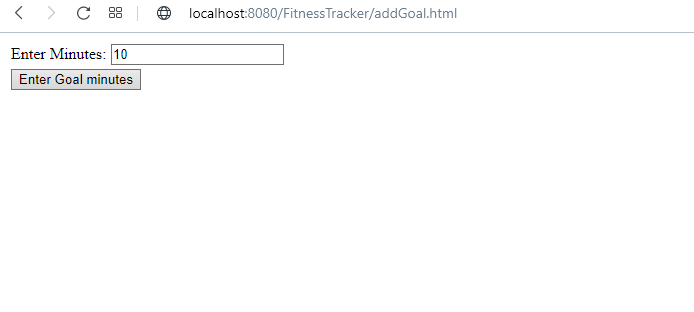

Requirements to run:
- Tomcat: v7.0.96
- Java 7 / JDK 1.7
- Maven 3+

This project was created by following the "Introduction to Spring MVC" course on PluralSight.

**Functionality:**

This simple project allows you to track your fitness goals by entering a goal in minutes.
You can then enter how many minutes you exercised for today and which activity you did
(out of a choice of running, biking or swimming).

**Technical Info:**

The project uses Java (specifically Spring Framework and Spring MVC) for backend
and JSP/html and jQuery for frontend. It follows a Model View Controller architecture
as well as having a Service tier for business logic (there is no repository tier
as there is no persistent data being stored in this project). Maven is used for 
dependency management and Tomcat is used as the application server.

The backend consists of a REST API to interact with the frontend. The frontend has for this
project is basic and does not have any CSS/styling. However, the project does have some advanced
features, such as localisation (having Spanish language support), validation and logging.

**Screenshots:**

Add Goal Page:
 

Add Minutes Page:

Validation Example:
